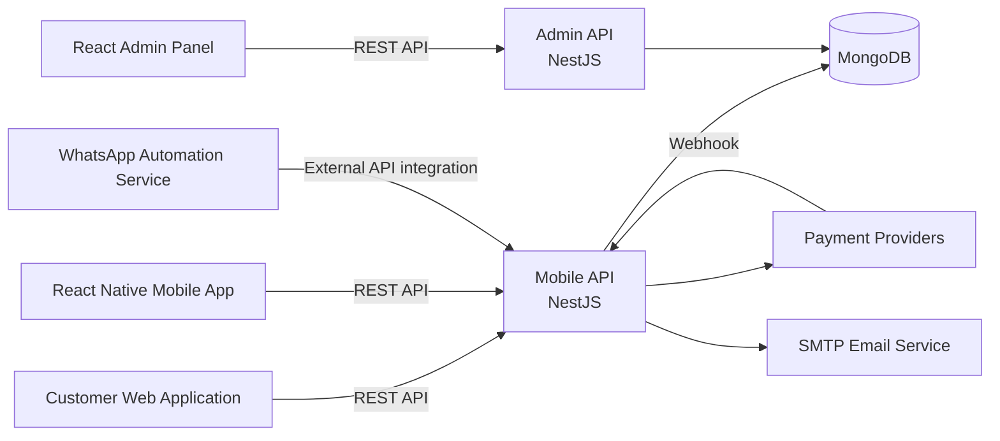
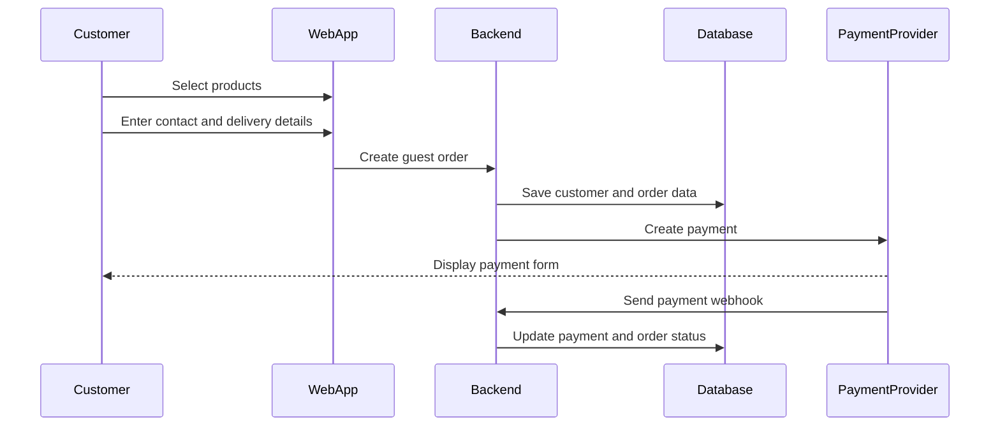
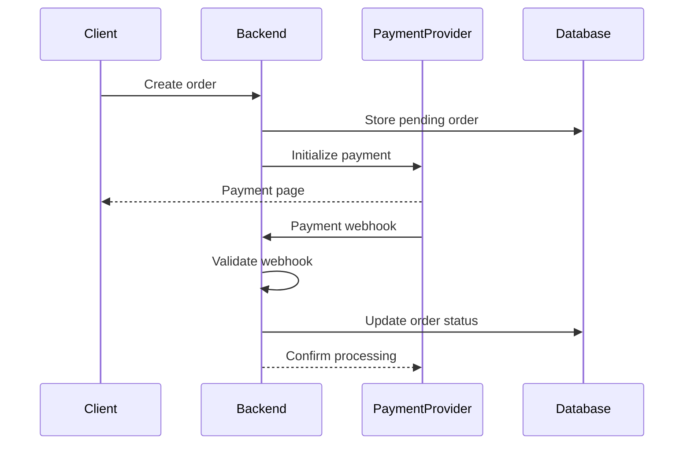
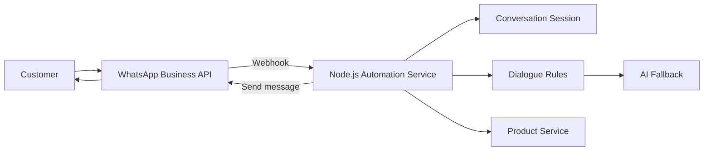

# Marketplace Backend Architecture — Case Study

> Sanitized architecture case study based on a commercial marketplace platform that I supported and developed.

The original source code, credentials, infrastructure details, customer data and internal business information are not published because they belong to the company and contain confidential information.

This repository demonstrates the system architecture, technology stack, major modules, integrations and business flows without exposing proprietary code.

---

## Project Overview

The platform was built as a marketplace ecosystem consisting of:

- a backend API;
- an administrative panel;
- a cross-platform mobile application;
- a customer-facing web application;
- payment integrations;
- email notifications;
- WhatsApp sales automation.

The backend served several client applications and handled authentication, users, products, orders, warehouses, payments, content and external integrations.

---

## My Contribution

I joined the company as a technical specialist and gradually took responsibility for backend development, integrations and production support.

My responsibilities included:

- supporting and extending an existing NestJS backend;
- developing and modifying REST API endpoints;
- working with MongoDB and Mongoose;
- updating checkout, authentication and user flows;
- working with products, users, orders and warehouses;
- supporting payment integrations and webhook processing;
- testing and documenting API endpoints with Swagger and Postman;
- deploying backend updates to the production server;
- diagnosing and resolving production issues;
- restoring backend and database connectivity after infrastructure failures;
- working directly with the project owner on requirements and technical tasks;
- developing a separate WhatsApp sales automation service.

---

## Technology Stack

### Backend

- Node.js
- TypeScript
- NestJS
- MongoDB
- Mongoose
- REST API
- Swagger / OpenAPI
- JWT
- Passport.js
- class-validator
- bcrypt
- Axios
- Nodemailer
- Handlebars
- Webhooks

### Client Applications

- React and TypeScript administrative panel
- React Native and Expo mobile application
- HTML, CSS and JavaScript web client

### Integrations

- TipTop payment service
- Halyk ePay
- SMTP email notifications
- WhatsApp Business API
- OpenAI API for conversational automation
- Payment and messaging webhooks

---

## High-Level Architecture



The backend was implemented as a modular NestJS application with separate entry points for the customer/mobile API and administrative API.

This was not a microservice architecture. It was a modular backend with shared access to MongoDB and several external integrations.

---

## Backend Structure

### Mobile API

The customer-facing API included modules for:

- authentication;
- registration and login;
- email verification;
- password recovery;
- users and profiles;
- products and brands;
- orders;
- guest checkout;
- warehouses;
- documents;
- FAQ;
- videos;
- payment processing;
- email notifications.

### Admin API

The administrative API included modules for:

- administrator authentication;
- user management;
- product management;
- brand management;
- order management;
- warehouse management;
- FAQ management;
- video management;
- document management;
- payment webhook processing.

---

## Client Applications

### Administrative Panel

The administrative panel was built with React and TypeScript.

It provided interfaces for:

- viewing and editing products;
- adding and editing brands;
- viewing orders;
- changing order statuses;
- managing users;
- managing warehouses;
- managing FAQ;
- managing videos;
- managing documents and platform content.

### Mobile Application

The mobile application was built with React Native and Expo and supported Android and iOS.

Main features included:

- registration and login;
- email verification;
- password recovery;
- guest mode;
- product catalog;
- product details;
- favorites;
- shopping cart;
- checkout;
- payments;
- order history;
- order details;
- profile management;
- warehouses;
- documents;
- FAQ;
- videos;
- support;
- referral and deep-link flows.

### Web Application

The customer-facing web application was built with HTML, CSS and JavaScript.

Main pages included:

- home page;
- catalog;
- product page;
- cart;
- checkout;
- payment status;
- login;
- registration;
- password recovery;
- profile;
- orders;
- order details;
- company information;
- support.

---

## Key Business Flow: Guest Checkout

One of the important product changes was reducing registration friction.

Customers could provide the minimum required contact and delivery information and create an order without completing full account registration before payment.



This flow reduced unnecessary steps for new customers and allowed the sales and logistics teams to complete missing information later when required.

---

## Payment Processing

The platform worked with external payment providers.

The general payment flow was:

1. The client application created an order.
2. The backend prepared a payment request.
3. The customer completed the payment through the payment provider.
4. The payment provider sent a callback or webhook to the backend.
5. The backend validated the event.
6. The order and payment statuses were updated in MongoDB.
7. The customer or internal team received the relevant notification.



Sensitive payment credentials, merchant identifiers and callback URLs are intentionally excluded from this repository.

---

## WhatsApp Sales Automation

A separate Node.js service was developed to automate customer communication through WhatsApp Business API.

The service handled:

- webhook verification;
- incoming WhatsApp messages;
- customer conversation sessions;
- deterministic sales scenarios;
- product information;
- purchase links;
- AI fallback responses;
- outgoing WhatsApp messages;
- error handling and logging.



The automation successfully processed real customer leads and supported completed sales during its operational period.

The production tokens, phone numbers, customer conversations and internal sales prompts are not published.

---

## API Documentation

The backend used Swagger / OpenAPI for:

- documenting endpoints;
- inspecting request and response structures;
- reviewing DTO models;
- testing protected and public endpoints;
- validating integration flows;
- supporting communication between backend and client application development.

Example endpoint groups:

```text
/auth
/users
/profile
/products
/brands
/orders
/warehouses
/documents
/faq
/videos
/payments
/webhooks
```

Exact production URLs and internal endpoint details are intentionally not published.

---

## Production Support Experience

In addition to feature development, I worked with a live production environment.

This included:

- deploying new backend versions;
- configuring application connections;
- diagnosing failed deployments;
- resolving backend runtime errors;
- restoring database connectivity;
- working with production environment variables;
- checking API behavior after releases;
- supporting communication between the backend and client applications;
- troubleshooting payment and webhook issues.

One major incident involved infrastructure availability problems that affected the server and database connection. I restored the backend configuration and database connectivity in another available environment and returned the platform to a working state.

---

## Security and Confidentiality

The following information is intentionally excluded:

- source code owned by the company;
- `.env` files;
- JWT secrets;
- MongoDB connection strings;
- database usernames and passwords;
- SMTP credentials;
- WhatsApp access tokens;
- payment service secrets;
- merchant identifiers;
- production server IP addresses;
- SSL certificate paths;
- customer names;
- phone numbers;
- email addresses;
- delivery addresses;
- payment transactions;
- internal administrator credentials;
- production logs.

All diagrams and descriptions in this repository are simplified and sanitized.

---

## Repository Contents

The repository will contain only non-confidential portfolio materials:

```text
backend-architecture-demo/
├── README.md
├── images/
│   ├── architecture.png
│   ├── admin-orders.png
│   ├── admin-products.png
│   ├── mobile-catalog.png
│   ├── mobile-cart.png
│   ├── mobile-orders.png
│   ├── web-catalog.png
│   ├── web-checkout.png
│   ├── swagger-mobile.png
│   └── swagger-admin.png
└── docs/
    ├── backend-modules.md
    ├── guest-checkout.md
    ├── payment-flow.md
    └── production-support.md
```

No proprietary application source code is included.

---

## Screenshots

Screenshots will be added after removing or masking:

- customer names;
- phone numbers;
- email addresses;
- physical addresses;
- transaction identifiers;
- order identifiers;
- internal URLs;
- production credentials.

---

## What This Case Study Demonstrates

This case study demonstrates practical experience with:

- an existing commercial codebase;
- NestJS modular architecture;
- REST API development;
- MongoDB and Mongoose;
- authentication and authorization;
- marketplace business logic;
- guest checkout;
- payment integrations;
- webhook processing;
- React and React Native clients;
- API documentation;
- production deployment;
- production incident resolution;
- external service integration;
- sales automation through WhatsApp Business API.

---

## Author

**Miras Kalaubek**

Backend Developer focused on Node.js, TypeScript and NestJS.

- GitHub: [MirasKalaubek](https://github.com/MirasKalaubek)
- Location: Almaty, Kazakhstan

---

## Disclaimer

This repository is an independent, sanitized portfolio case study.

It does not contain the original commercial source code, company credentials, customer data or confidential internal documentation.
